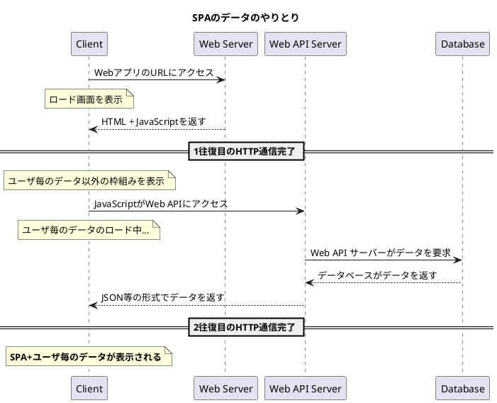
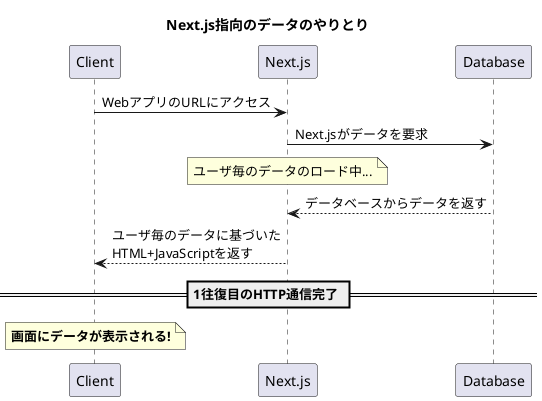

# Sekirei-Todo
身の回りにセキレイがたくさんいるので、
それをモチーフにしたTo-Do ListをNext.jsで作ります。

実現したい機能は以下です：
[ ] localStorageとClient Componentを適切に使用し、ある程度のオフライン使用に耐える
[x] セキレイのかわいいアイコンをメインに配置して、リアルに尻尾を振る
[x] Server Componentも使用し、Client ComponentとのCompositionを試みる
[x] drizzle orm によるデータベースとのやり取りを行う

## 環境変数の切り替えをどうするか？
`next build && next start`では`NODE_ENV=production`が定義されている

`next dev`では何もない

.env.* はNext.js環境に自動でロードされて、
\*部分には`NODE_ENV`が入るらしい、

`NODE_ENV=development`とすれば、.env.developmentが、
`NODE_ENV=production`とすれば、.env.productionが読み込まれるそうなので
これを活用してみたい

## Next.jsらしいデータのやり取りを可視化したい




## ログイン状態の取得をクライアントコンポーネントに
Headerのログアウトボタン及びユーザ名表示がdynamicである必要があったため
下の問題が起きた様なきがする。

クライアントコンポーネントからもログイン、ログアウトできるので
これを試してみる。

## 想定外のserver dynamic rendering
ユーザ情報をヘッダコンポーネントに表示するようにしていたが、
これはdynamic server rendering (ビルド結果にfがつくやつ)になっている

layout.tsxがdynamicになってしまっているせいか、
その下のすべてのページがdynamicになっている...?

これを解決したい

## next build && next start 時の認証エラー
middlewareからPoolConnectionを呼び出そうとすると
PoolConnection is not a constructorというエラーが出る

await mysql.createConnectionすると大丈夫なので、
jestのテストをどうするか（このためにもPoolConnectionにしていた）は
再考することにしたい

## tRPCの導入
事前の設定やコーディングがある程度必要だが、1時間もあれば導入できた。
使い心地はストレスフリーでとてもよい

## テストデータの書き込み方法検討
データベースが毎回まっさらからスタートだとテストしづらい気が...
どこかのタイミングでパスワードなどハッシュ化したうえで記録したいが...
- MySQLマイグレーション時に、テスト中か否かのフラグを読み取って
場合に応じて書き込み処理を行う。
  - パスワードのハッシュ化などを適切に関数化しておけば、
  これも適切に行えそう
- MySQLマイグレーション後にテストデータを追加する。
これはsqlスクリプトとしてinsert文を手書きして行う。
  - ハッシュ化した値は何らかの方法でコピペしないといけないかも
- Next.jsのServer Action等として、テスト用データの追加コードを動かす
  - 環境変数やテスト用ボタンを押すことで、テスト用データが書き込まれる。
  その場合2重に書き込んだ場合や、テストの手間を考える必要がある

技術的に少し難易度が高くなりそうだが、最初の案を実装してみる

## DrizzleとDockerとMySQLと...
これまでの開発環境では、MySQL Docker Imageを使っていた

マルチステージビルドとしてDB設定関連のファイルを先に生成して、
実行用のイメージに移すことで起動時間を短縮するものも使った

現在は...
- 素のMySQLコンテナを生成
- 開発環境用のNext.jsコンテナを生成
- 開発環境用のNext.jsコンテナからDrizzleを実行し、MySQLコンテナにSchemaに沿ったDBを生成

という順番で行っているが、いくつか問題がありそう
1. テスト用のデータを追加するために/docker-entrypoint-initdb.dに
ファイルを追加する方法が上手くいかない
2. drizzle-kit push を使う場合にはすでにDBにデータがある場合失敗する

...なので、感覚としては
- マイグレーションのためだけのコンテナを用意し、
MySQLデータベースにマイグレーションとテストデータ投入を行う
- 開発環境起動時にはそこで得られたデータベース内容を元に起動する

...といったことをしたい
npmのmonorepo機能、workspaceが使える？試してみるか...
→ OK. monorepo機能を用いたマイグレーション機構を追加、mainブランチに取り込み

## DB設計
- タスクをプロジェクト毎に管理できるようにする
- （他のユーザはいないと思うが）ユーザごとに確実にデータを分ける

```plantuml
hide circle
skinparam linetype ortho
entity Users {
  * id: varchar(128) <<unique username>>
  * passWithSalt: binary(256)
  --
}

entity Projects {
  * id: varchar(256) <<Project name, unique per user>>
  * userId: varchar(128)
}

entity Tasks {
  * id: bigint autoincrement
  * userId: 
}

Users ||--o{ Projects
Users ||--o{ Tasks
Tasks }o--o| Projects
```
- Userから見ると...
  - 関連するTasksは0個かもしれないし、多数かもしれない
  - 関連するProjectsは0個かもしれないし、多数かもしれない
- Tasksから見ると...
  - 関連するUsersはただ1つのみ
  - 関連するProjectsは0個かただ1つのみ
- Projectsから見ると...
  - 関連するUsersはただ1つのみ
  - 関連するTasksは0個かもしれないし、多数かもしれない

...つまり、複数のユーザがタスクやプロジェクトを共有しようとすると、
この設計ではうまくいかないことになる...(が、最初はこれでいいか...)


